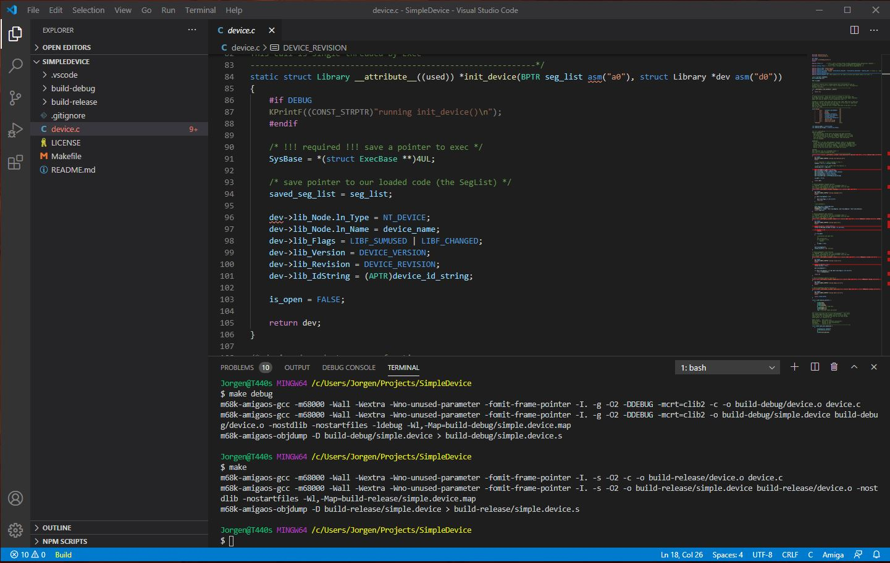
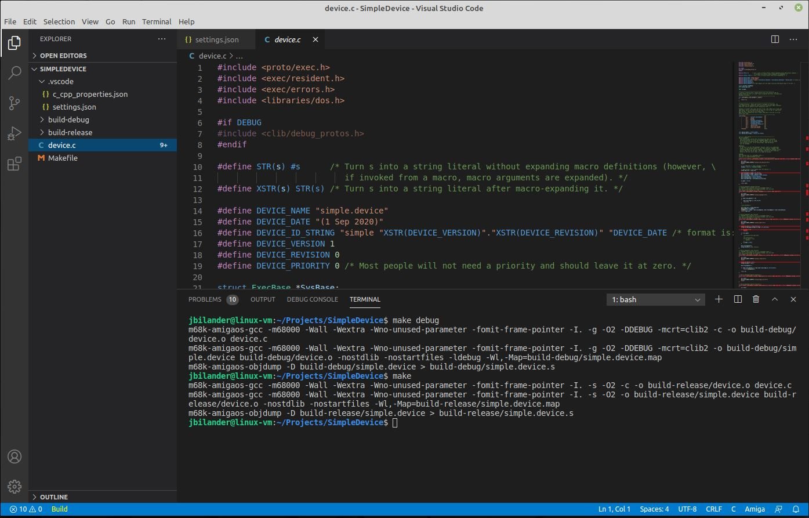
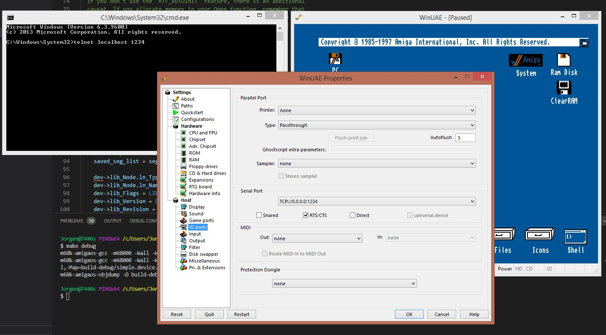
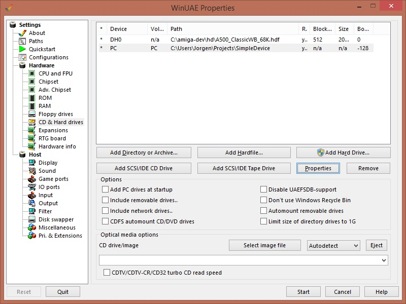
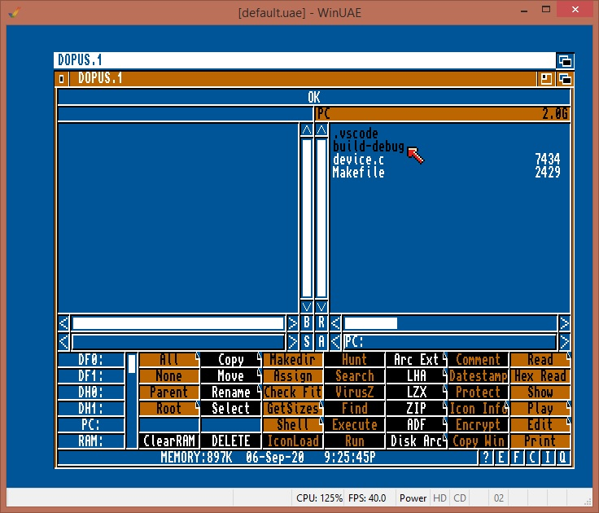
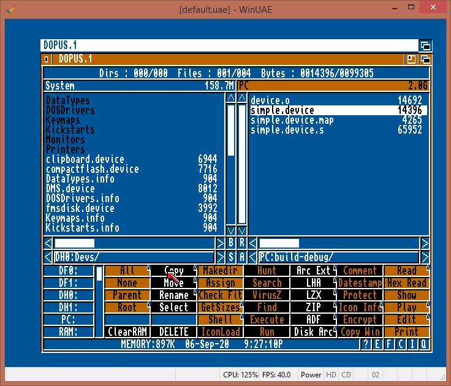

# Amiga SimpleDevice
Amiga Simple Device skel in C using Bebbo's or Bartman's gcc.
***
This example shows you how to build a simple device driver for the Amiga in C with a modern cross compile gcc-toolchain for the Amiga using VSCode, driver should work with 1.3 and above. I haven't tested with older versions.
***
The `Makefile` is made to work with both `Bebbo's amiga-gcc toolchain` as well as `Bartman^Abyss' amiga-elf gcc toolchain`. Currently it is set by default to Bebbo's toolchain, but you can easily switch by commenting out `hunk-toolchain` and uncomment `elf-toolchain` in the Makefile. Obviously you need to install "your" prefered toolchain for it to work and set the correct path to compiler and some settings in .vscode for intellisense and compilation to work. The Makefile should also work with Bartman's `gnumake.exe` running natively on Windows as well as `make` working on MSYS2 and on Linux. The `device.c` is only made to compile with Bebbo's toolchain since it is using register assignments to function parameters, no such thing exists in the elf-toolchain but you can work around it using inline asm should you want to try out building with the elf-toolchain instead. The `Makefile` is also set to automatically disassemble the build so that the assembly generated can easily be inspected. If you are using the elf-toolchain and have Bebbo's toolchain installed as well you can uncomment the `m68k-amigaos-objdump -D $(DIR)/$(FILENAME) > $(DIR)/$(FILENAME).s` line and you will have an disassembly of the executable hunk-file generated after the `elf2hunk` step as well.
***
The Makfile is set to delete and recompile the executable if any source files `(%.c or %.s)` have been touched before running `make`. Just comment out the `@$(DEL_EXE)` on both `%.c and %.s` if you don't want it to work this way.
***
### Some screenshots:
On Windows with MSYS2:  

 

On Linux Mint:  

***

### Make commands:
* build debug: `make debug`  (This created a folder `build-debug` with all the built files in it, compiles with debug-flags set)
* build release: `make`  (This created a folder `build-release` with all the built files in it, compiles with release-flags set)
* clean debug: `make cleandebug`
* clean release: `make cleanrelease`
* clean both: `make clean`

***

### "Debug" with KPrintF in methods running in Forbidden mode by Exec:
As you might know `Init_Device/Open/Close/Expunge` runs single threaded by Exec, no other task is allowed to run in this mode so no writing to a dos-console possible as it would mean deadlock, however with the `debug.lib (libdebug.a)` linked into our build it is possible to get KPrintF-statements out to the serial port terminal. Good thing is WinUAE has an option to emulate the serial terminal of the Amiga and then we can use telnet to connect to it with the command `telnet localhost 1234`

Enable WinUAE serial port on 1234, and open a cmd-prompt and write the telnet command (obviously you'll need telnet installed first via `Control Panel->Program and Features->Turn windows features on/off)`.
 
 

***
For conveniency, do also map the Project folder in WinUAE so we easily can copy our newly built device driver over to the emulated Amiga:
 

***
With dopus on the Amiga you can copy the simple.device into devs.
 

 
<a href="images/copy_driver_to_devs_with_dopus.jpg">

  
